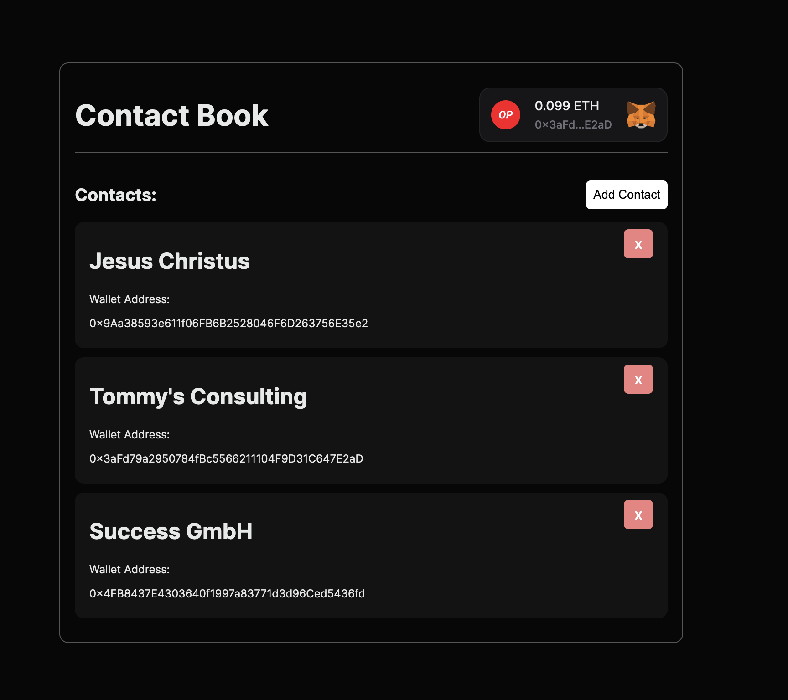

# Contact Book DApp

Hallo! Willkommen bei meiner dezentralisierten Anwendung (DApp), dem Contact Book. Diese Anwendung wurde mit ThirdWeb und Next.js erstellt und erlaubt es Benutzern, ihre Wallet (digitale Brieftasche) zu verbinden und Kontakte hinzuzufügen und anzusehen.



## Wie du diese Anwendung selbst ausprobieren kannst

1. Du musst zuerst eine Kopie von diesem Code auf deinen Computer herunterladen. Das nennt man "klonen". Du kannst das tun, indem du den folgenden Befehl in deinem Terminal eingibst:

```bash
git clone https://github.com/Gracing47/contactbookweb.git
```

2. Nachdem du den Code geklont hast, musst du in das Verzeichnis (Ordner) des Projekts wechseln und alle benötigten Softwareteile installieren. Du kannst das tun, indem du die folgenden Befehle in deinem Terminal eingibst:

```bash
cd contactbookweb
npm install
```

3. Jetzt kannst du die Anwendung starten und in deinem Webbrowser ausprobieren! Gib dazu den folgenden Befehl in dein Terminal ein:

```bash
npm run dev
```

Jetzt solltest du in der Lage sein, die Anwendung in deinem Webbrowser zu öffnen, indem du http://localhost:3000 in die Adressleiste eingibst.

